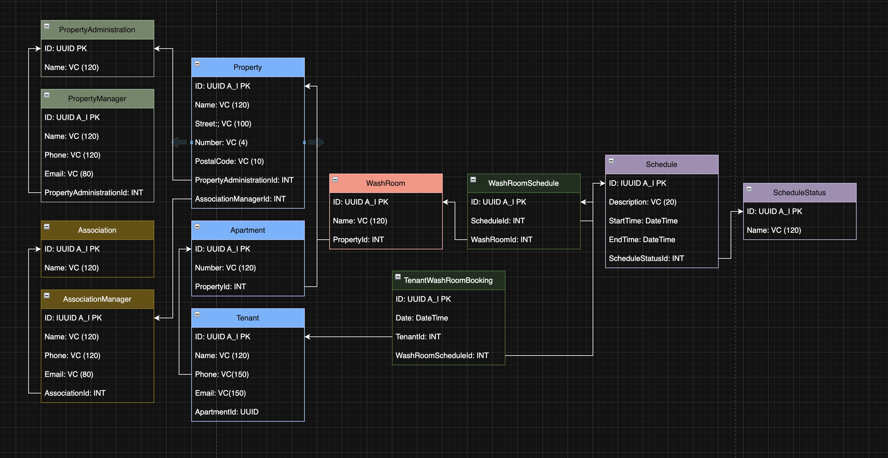

# Washroom Backend

A .NET backend API for managing laundry room bookings in residential properties. This solution enables tenants to book washroom/laundry room time slots in their apartment buildings.

## Project Structure

```
washroom_backend/
├── API/                    # Web API layer
│   ├── Controllers/        # API endpoints
│   ├── Program.cs          # Application entry point
│   └── appsettings.json    # Configuration
├── Core/                   # Core business logic layer
│   └── Models/             # Domain models
└── washroom_backend.sln    # Solution file
```

## Technology Stack

- **.NET 10.0** - Target framework
- **ASP.NET Core Web API** - RESTful API framework
- **OpenAPI/Swagger** - API documentation
- **Scalar** - API reference UI

## Prerequisites

- [.NET 10.0 SDK](https://dotnet.microsoft.com/download) or later
- A compatible IDE (Visual Studio 2022, VS Code, JetBrains Rider)

## Getting Started

### Clone the Repository

```bash
git clone https://github.com/therealdanmalmx/washroom_backend.git
cd washroom_backend
```

### Build the Solution

```bash
dotnet build
```

### Run the API

```bash
cd API
dotnet run
```

The API will be available at `https://localhost:5001` (or the port specified in your configuration).

### API Documentation

When running in development mode, the API documentation is available at:
- **OpenAPI Spec**: `/openapi/v1.json`
- **Scalar API Reference**: `/scalar/v1`

## Database Schema

The system uses the following database schema to manage laundry room bookings:



### Entities

| Entity | Description |
|--------|-------------|
| **PropertyAdministration** | Top-level administration entity managing multiple properties |
| **PropertyManager** | Managers responsible for properties, linked to a PropertyAdministration |
| **Property** | Residential properties with address information |
| **Apartment** | Individual apartments within a property |
| **Tenant** | Residents living in apartments who can make bookings |
| **Association** | Property associations/organizations |
| **AssociationManager** | Managers of property associations |
| **WashRoom** | Laundry room facilities available for booking |
| **Schedule** | Time slots available for booking (start/end times) |
| **ScheduleStatus** | Status of schedule slots (e.g., available, booked, maintenance) |
| **WashRoomSchedule** | Links washrooms to their available schedules |
| **TenantWashRoomBooking** | Booking records linking tenants to washroom schedules |

### Entity Relationships

- A **PropertyAdministration** manages multiple **Properties** and **PropertyManagers**
- A **Property** contains multiple **Apartments** and **WashRooms**
- **Tenants** reside in **Apartments** and can create **TenantWashRoomBookings**
- **WashRooms** have multiple **WashRoomSchedules** linking them to **Schedules**
- **Schedules** have a **ScheduleStatus** indicating availability
- **Associations** have **AssociationManagers** and are linked to properties

## Configuration

Application settings can be configured in `API/appsettings.json`:

```json
{
  "Logging": {
    "LogLevel": {
      "Default": "Information",
      "Microsoft.AspNetCore": "Warning"
    }
  },
  "AllowedHosts": "*"
}
```

## Development

### Running Tests

```bash
dotnet test
```

### Building for Production

```bash
dotnet publish -c Release
```

## License

This project is proprietary software.
